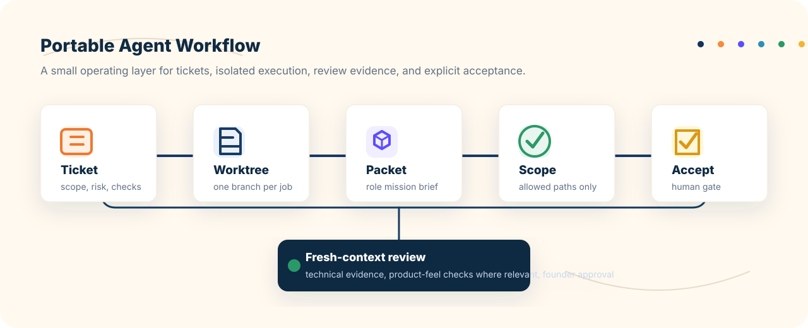
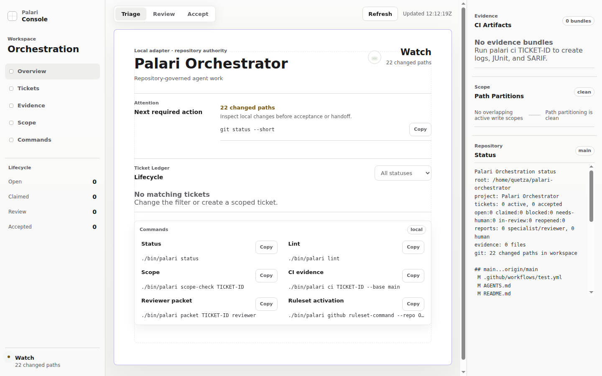

<p align="center">
  
</p>

<h1 align="center">Palari Orchestrator</h1>

<p align="center">
  Repo-native governance for AI coding agents: scoped tickets, isolated work, evidence, fresh review, and explicit human acceptance.
</p>

<p align="center">
  
  
  
  
  
</p>

<p align="center">
  <a href="#why-palari">Why Palari</a> ·
  <a href="#how-it-works">How it works</a> ·
  <a href="#quick-start">Quick start</a> ·
  <a href="#optional-console">Console</a> ·
  <a href="#command-reference">Commands</a>
</p>

Palari Orchestrator is the portable software-repo version of the Palari idea:
give an AI coworker a named job, approved sources, visible records, and a
permission moment before anything important moves.

```text
intent -> proposal -> ticket -> worktree -> packet -> scope-check -> ci evidence -> review -> accept
```

It is built for founders, operators, product people, and small technical teams
who want AI-assisted coding to feel controlled instead of mysterious. The repo
stays the source of truth. Agents get clear boundaries. Humans keep acceptance
authority.

## At a Glance

| Question | Answer |
| --- | --- |
| Who is it for? | Teams delegating coding work to agents while keeping human review and repository control. |
| What is the core? | Bash, Markdown, git, templates, and checks that can move into almost any repo. |
| What does it enforce? | Proposal adoption, ticket lifecycle, allowed/forbidden paths, evidence bundles, fresh-context review, and acceptance gates. |
| What is optional? | GitHub rulesets, hooks, MCP wrappers, opencode execution, local sandboxes, the console, and repo-memory adapters. |
| What is it not? | A hosted agent platform, product-specific Palari app code, or a replacement for human judgment. |

## Why Palari

| Without a control layer | With Palari |
| --- | --- |
| The agent remembers the task in chat. | The ticket lives in the repo. |
| Scope drift is noticed late. | Allowed and forbidden paths are checked. |
| Work happens in the main checkout. | Work starts in a ticket worktree. |
| Review depends on summaries. | Review gets packets, reports, and CI evidence. |
| "Done" can be vague. | Acceptance is explicit and recorded. |

Palari is not a generic multi-agent platform. It is a few repo-native primitives
that make agent-led coding easier to delegate, inspect, and stop.

## How It Works



1. Create a ticket with the goal, allowed paths, forbidden paths, and checks.
2. Give the agent a clean worktree and a packet that says exactly what it can do.
3. Run scope checks and CI evidence before review.
4. Review with fresh context.
5. Accept only when the evidence, scope, and authority gates pass.

Ceremony scales with risk. Small R0/R1 tasks stay short. R2+ work gets stronger
review and evidence gates. R3/R4 work requires human confirmation.

## What You Get

| Primitive | What it protects |
| --- | --- |
| Lead proposals | Messy founder intent becomes adoptable tickets without letting the planner implement. |
| Scoped tickets | The agent knows where it may work and what must be verified. |
| Worktree-first execution | Each ticket gets isolated from the main checkout. |
| Agent packets | Specialists, reviewers, and acceptors get the right context. |
| Scope checks | Changed files are compared against allowed and forbidden paths. |
| CI evidence | Logs, JUnit, SARIF, and an integrity manifest are written for the ticket. |
| Human acceptance | `palari accept` refuses missing, failed, or stale evidence and records who accepted. |

## Quick Start

Try Palari in this repo:

```bash
git clone https://github.com/CoyStan/palari-orchestrator.git
cd palari-orchestrator
./bin/palari init
./bin/palari status
tests/run-golden.sh
```

Adopt it in another repo:

```bash
./bin/palari adopt /path/to/repo
cd /path/to/repo
./bin/palari doctor
./bin/palari status
```

Add optional GitHub and local hook adapters:

```bash
./bin/palari adopt /path/to/repo --ci --hooks
```

The workflow file alone does not protect merges. Install the ruleset when you
want GitHub to require the Palari check:

```bash
palari github install-ruleset --repo OWNER/REPO
```

GitHub PRs are intentionally ticketed by default. The workflow calls
`palari github ci`, which resolves tickets from `PALARI_TICKET_ID`, a
`ticket/TICKET-ID` branch name, or changed ticket files. If none is found, the
check fails with instructions instead of silently running a weak gate. Use
`palari github ci --repo-only` only for explicit maintenance checks that are not
claiming ticket-governed agent work.

`adopt` refuses non-git targets, keeps existing files by default, writes
`AGENTS.palari.md` instead of overwriting an existing `AGENTS.md`, runs
`palari init`, and finishes with `palari doctor`.

## First Ticket

If the work is still fuzzy, start with a lead/planner proposal:

```bash
palari propose create APP-PROP-0001 "Improve onboarding" \
  --planner openclaude \
  --model deepseek/deepseek-v4-flash \
  --intent "Make the repository easier for non-programmers to understand."

palari propose packet APP-PROP-0001
palari propose adopt APP-PROP-0001 \
  --ticket APP-0001 \
  --allowed "src/**" \
  --allowed "tests/**" \
  --allowed "tickets/**" \
  --allowed "reports/**" \
  --verify "npm test" \
  --review
```

The lead can write `tickets/proposed/**` and `reports/planning/**`. It cannot
implement, accept, push, commit, or broaden authority. A human adopts the
proposal before executor work begins.

If the work is already clear, create the ticket directly:

```bash
palari ticket create APP-0001 "first scoped slice" \
  --stream app \
  --risk R1 \
  --allowed "src/**" \
  --allowed "tests/**" \
  --allowed "tickets/**" \
  --allowed "reports/**" \
  --verify "npm test" \
  --review
```

Then hand the agent its workspace and mission:

```bash
palari worktree APP-0001
palari packet APP-0001 specialist
```

Before acceptance:

```bash
palari scope-check APP-0001
palari ci APP-0001 --base main
palari ticket ready APP-0001
palari packet APP-0001 reviewer
palari accept APP-0001 --by founder
```

`accept` moves the ticket to `tickets/closed/`. It does not merge, push, deploy,
or bless missing evidence.

## Optional External Executors

Palari can wrap stronger coding agents without making them the authority. The
first wrapper targets opencode:

```bash
palari agent run APP-0001 --executor opencode
```

The wrapper prepares the Palari worktree and packet, runs opencode with Palari
lifecycle commands denied, captures executor evidence, then runs Palari scope
and CI gates. It does not accept, push, merge, or deploy.

OpenClaude can act as a restricted lead/planner when paired with
`palari propose packet`. DeepSeek models can be used through whichever executor
adapter supports them. Palari keeps the same boundary: planner proposes, executor
implements, reviewer checks, human accepts.

Use a disposable local copy when you want to test executor behavior away from
the canonical checkout:

```bash
palari sandbox create APP-0001
```

## Optional Console

The local console is a read-only view over `palari snapshot --json`. It helps
non-programmers see tickets, evidence, scope health, and the next command
without turning Palari into a web app.

```bash
palari web
```



## Design Principles

- **Repo is law:** tickets, reports, evidence, and config live in the repository.
- **Small core:** Bash, Markdown, and git remain enough for the portable loop.
- **Adapters stay optional:** GitHub, MCP, hooks, console, and skills do not own acceptance.
- **Humans keep authority:** review can recommend; acceptance is explicit.
- **No product lock-in:** product-feel and app-specific preferences are examples or adapters.

## Optional Repo Memory

Palari can store repo-native memory under `memory/**/*.md`: accepted decisions,
path-level invariants, gotchas, failure patterns, and command knowledge.

Memory is source-controlled Markdown. SQLite FTS is only an optional generated
search cache under `.palari/cache/`. The orchestrator uses active memory to
enrich packets; specialists receive the selected memory in their packet and
should not browse the full memory directory unless blocked.

```bash
palari memory add invariant "Console stays read-only" \
  --truth-key web.console.mutation_boundary \
  --path "adapters/web/**" \
  --source-ticket WEB-0001

palari memory index
palari memory query --path adapters/web/server.py
palari packet WEB-0002 specialist
```

## Command Reference

<details>
<summary>Core, adapter, and experimental commands</summary>

### Core Commands

| Command | Purpose |
| --- | --- |
| `palari init` | Create the ticket, report, and handoff directories expected by the workflow. |
| `palari adopt /path/to/repo` | Copy Palari into an existing git repo, initialize it, and run the doctor. |
| `palari doctor` | Check whether the current repo has the required Palari files and directories. |
| `palari status` | Show current tickets and workflow health at a glance. |
| `palari snapshot --json` | Print the repo-native JSON state model used by adapters. |
| `palari propose create ID TITLE` | Create a restricted lead/planner proposal before executable ticket work exists. |
| `palari propose packet ID` | Print the restricted lead packet for a planner AI such as OpenClaude. |
| `palari propose adopt ID --ticket TICKET-ID` | Convert a human-approved proposal into a real scoped ticket. |
| `palari ticket create ID TITLE` | Create a scoped ticket with allowed paths, risk, checks, and review requirements. |
| `palari ticket claim ID` | Mark a ticket as claimed before implementation work starts. |
| `palari ticket heartbeat ID` | Renew the ticket claim lease. |
| `palari ticket ready ID` | Move a ticket into review once implementation evidence exists. |
| `palari ticket block ID` | Mark scoped work blocked. |
| `palari ticket needs-human ID` | Mark work that needs human authority or product judgment. |
| `palari ticket reopen ID` | Move an in-review ticket back to implementation. |
| `palari worktree ID` | Create or locate the ticket-specific git worktree. |
| `palari packet ID ROLE` | Generate the mission packet for a specialist, reviewer, acceptor/human, or custom review profile. |
| `palari sandbox create ID` | Create a disposable local repository copy for executor experiments. |
| `palari agent run ID --executor opencode` | Run opencode from a Palari packet and record executor evidence without accepting work. |
| `palari memory ...` | Manage optional repo-native memory and generated search indexes. |
| `palari ci ID --base REF` | Run scope/lint/report gates and write evidence artifacts. Fails closed without a ticket. |
| `palari ci --repo-only` | Run explicit non-merge-gate repository lint evidence. |
| `palari scope-check [ID]` | Compare changed files against allowed and forbidden path rules. |
| `palari scope-overlaps [ID]` | Detect overlapping active ticket write scopes. |
| `palari lint [ID]` | Validate ticket state and required reports. |
| `palari report-lint [ID]` | Validate specialist and reviewer report structure. |
| `palari accept ID --by NAME` | Close the ticket only after the acceptance gate is satisfied. |

### Adapter Commands

| Command | Purpose |
| --- | --- |
| `palari github ci --base REF` | Discover PR tickets from env, branch, or changed ticket files, then run merge-gate CI. |
| `palari github ruleset-command` | Print the `gh api` command that activates required checks. |
| `palari github install-ruleset` | Install the GitHub ruleset through `gh api`. |
| `palari mcp manifest` | Print optional MCP tool metadata for wrapper adapters. |
| `palari web` | Run the optional local Palari Console dashboard. |

### Experimental Commands

| Command | Purpose |
| --- | --- |
| `palari skill create NAME` | Scaffold an optional feature-contract skill adapter. |

</details>

## Governance Details

Palari's core remains Bash, Markdown, and git. The heavier governance features
ship as adapters:

- GitHub Actions: `palari init --ci` writes `.github/workflows/palari.yml`.
- GitHub rulesets: `palari init --ci` writes `.github/palari-required-checks.ruleset.json`.
- GitHub ticket discovery: `palari github ci` fails closed when no PR ticket is discoverable and prints the allowed ticketed and repo-only paths.
- Adoption: `palari adopt TARGET` copies the portable package into an existing git repository and runs `palari doctor`.
- Local hooks: `palari init --hooks` writes `lefthook.yml` for fast advisory checks.
- Lead proposals: `palari propose create`, `palari propose packet`, and `palari propose adopt` separate planning authority from implementation authority.
- Executor wrappers: `palari agent run TICKET-ID --executor opencode` invokes opencode from a Palari packet and records executor evidence.
- Local sandboxes: `palari sandbox create TICKET-ID` creates a disposable repository copy for executor experiments.
- Evidence integrity: `palari ci` writes `reports/evidence/<ticket>/verification.log`, `junit.xml`, `palari.sarif`, and `manifest.json`; `accept` validates manifest status, current commit, and artifact hashes before closing a ticket.
- Trusted merge evidence: the GitHub adapter uploads and attests `palari-evidence.tgz` on trusted repository runs. GitHub rulesets must be installed before this protects merges.
- Concurrency: `ticket claim` records lease metadata, `ticket heartbeat` renews it, and `scope-overlaps` blocks path-scope collisions by default.
- MCP: `palari mcp manifest` exposes a thin command manifest for optional MCP wrappers.
- Web console: `palari web` starts a local dashboard that renders `palari snapshot --json` and shows tickets, claims, evidence, scope overlaps, workflow health, and copyable next commands.

## Portable Core Boundary

Keep these concepts in the reusable package:

- role authority boundaries
- ticket lifecycle
- risk and report gates
- packet-first execution
- worktree isolation
- path scope checks
- fresh-context review
- custom required reports named by the adopting repository
- human or authorized-reviewer acceptance

Keep these concepts in repo-specific adapters or examples:

- product vocabulary and visual taste
- app-specific routes, screenshots, fixtures, and browser flows
- founder names, private workbench assumptions, outreach material, and live connector behavior
- project-specific danger zones beyond the configurable defaults

## Repository Map

<details>
<summary>Files and folders</summary>

```text
AGENTS.md                         Agent operating template for adopters
bin/palari                        Thin CLI entrypoint and command dispatcher
lib/palari/                       Portable Bash modules behind the CLI
palari.config.yaml                Example config for lifecycle, paths, roles, and gates
schemas/palari.config.schema.json Config schema
templates/                        Human report, handoff, and feature-contract templates
examples/                         Optional adopter examples such as product-feel review
contracts/                        Portable workflow contracts
adapters/                         Optional GitHub, hooks, MCP, opencode, OpenClaude, and web templates
skills/orchestrator/SKILL.md      Orchestrator usage guidance
skills/planner/SKILL.md           Restricted lead/planner guidance
skills/adoption/SKILL.md          Install/adoption guidance and rubric
tickets/proposed/                 Human-adopted proposal staging area
reports/planning/                 Lead packets and planning notes
tests/golden/                     Fixtures that prove the flow works
```

</details>

## Confidence Checks

```bash
tests/run-golden.sh
tests/run-cli-structure.sh
tests/run-adoption.sh
tests/run-agent-wrapper.sh
tests/run-dashboard-rubric.sh
./bin/palari lint
shellcheck -x bin/palari scripts/palari tests/run-cli-structure.sh tests/run-agent-wrapper.sh
shfmt -d bin/palari scripts/palari lib/palari/*.bash tests/run-cli-structure.sh tests/run-agent-wrapper.sh
actionlint
python3 -m py_compile adapters/web/server.py
bats tests
```

The golden test creates a temporary repository, initializes the orchestrator, creates a ticket, prepares a worktree, checks packet output, simulates specialist and review evidence, runs scope/lint checks, and exercises the acceptance gate.
